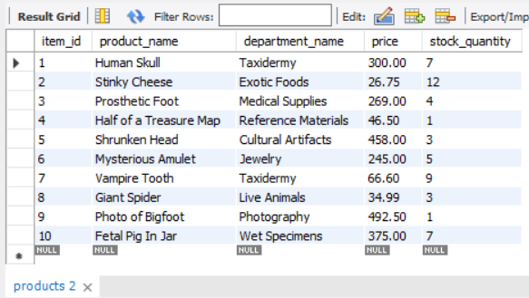
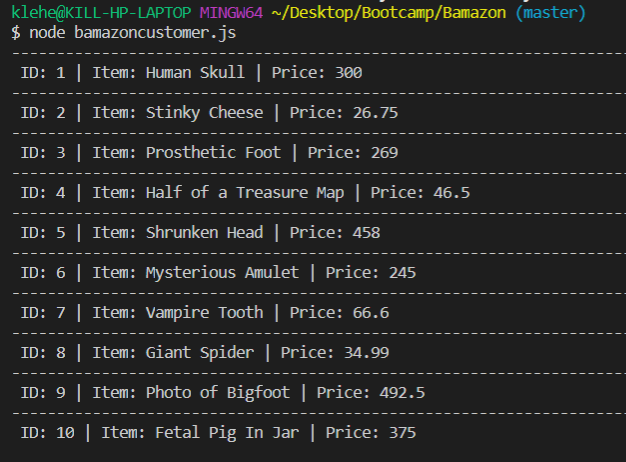
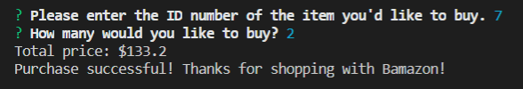
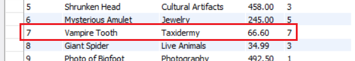
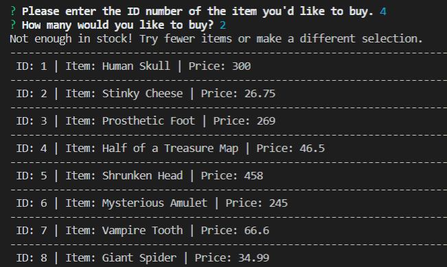

# Bamazon

#### This app allows the user to view items for sale and purchase them from my warehouse. The app also updates my inventory numbers in the database.

#### When the app starts, it displays a list of all available products and their prices. The user selects a product by entering the ID number, then tells the app how many of that item they want. If I have enough inventory in my warehouse, the total price is calculated and the purchase goes through. If there is not enough inventory, the user is prompted to order fewer of that item or choose a different item.

#### Technologies used in this app:
* JavaScript
* Node.js
* Mysql package
* Inquirer package

### Screenshots of Bamazon in action...

#### MySQL Database:

#### Showing Items To User:

#### Making A Purchase:

#### Inventory Being Updated:

#### Not Enough Inventory:

